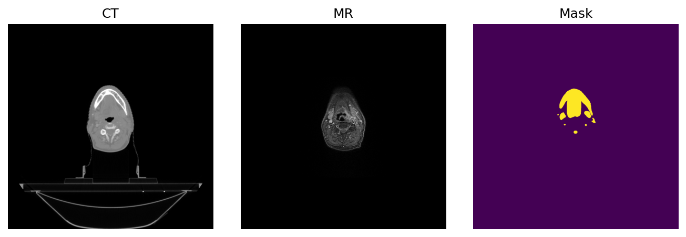

# TransformerHaNSeg: Multimodal Transformer for Head & Neck OAR Segmentation



## Project Overview

This repository contains a deep learning solution for automatic segmentation of Organs at Risk (OARs) in Head and Neck (HaN) CT and MR images using a Vision Transformer architecture. The model leverages both CT and MR modalities to improve segmentation accuracy across 30 different anatomical structures. The dataset used for training and evaluation is the [HaN-Seg: The Head and Neck Organ-at-Risk CT & MR Segmentation Dataset](https://zenodo.org/records/7442914).


### Key Features

- **Multimodal Image Fusion**: Combines CT and MR images for comprehensive anatomical representation
- **Vision Transformer Architecture**: Leverages self-attention mechanisms for capturing global relationships
- **Memory-Efficient Implementation**: Optimized data loading and processing pipeline for large 3D medical images
- **Case-Based Data Splitting**: Ensures generalization to unseen patient data

## Results

The model achieved excellent segmentation performance with an average Dice coefficient of **0.8779** across all OARs on the test set. Performance varies across different structures:

| Performance Category | Structures | Dice Coefficient |
|---------------------|------------|------------------|
| Excellent (>0.95)   | 10 structures | 0.95-0.99 |
| Very Good (0.90-0.95) | 9 structures | 0.90-0.95 |
| Good (0.80-0.90) | 6 structures | 0.80-0.90 |
| Moderate (0.60-0.80) | 3 structures | 0.60-0.80 |
| Challenging (<0.60) | 2 structures | 0.44-0.60 |

Top performing structures (Dice > 0.97):
- Structure 7: 0.9780
- Structure 8: 0.9780 
- Structure 23: 0.9871
- Structure 2: 0.9728
- Structure 28: 0.9715

Most challenging structures:
- Structure 0: 0.4437
- Structure 1: 0.4903
- Structure 29: 0.6003

## Technical Details

### Dataset

The HaN-Seg dataset consists of paired CT and T1-weighted MR images with expert segmentations of 30 organs at risk in the head and neck region. The dataset includes:

- Multiple patient cases from set_1
- CT images (base reference for spatial coordinates)
- T1-weighted MR images (resampled to CT space)
- Manual segmentations for 30 OARs

### Technical Challenges & Solutions

#### Inconsistent Mask Counts Between Patients
- **Challenge**: Different patient cases had varying numbers of OAR segmentation masks
- **Solution**: 
  - Identified reference case with complete set of OARs and used as expected count
  - Implemented dynamic padding for patients with fewer masks (zero-filled masks)
  - This approach ensures consistent tensor dimensions across all patients while preserving available annotations

#### Multimodal Image Registration
- **Challenge**: CT and MR images had different dimensions, orientations, and intensity characteristics
- **Solution**:
  - Used CT as the reference coordinate system
  - Implemented robust resampling pipeline using SimpleITK:
    - First attempted CenteredTransformInitializer with GEOMETRY setting
    - Fallback to identity transform if geometric alignment failed
    - Used appropriate interpolators (Linear for MR, NearestNeighbor for masks)
  - Handled edge cases with try/except blocks to ensure processing continued

#### Intensity Normalization
- **Challenge**: CT and MR have vastly different intensity scales and distributions
- **Solution**:
  - CT normalization: Clipped to [-1000, 1000] HU range and rescaled to [0, 1]
  - MR normalization: Applied min-max scaling for low variance cases
  - Added explicit handling for edge cases (e.g., constant intensity slices)

#### Memory Management
- **Challenge**: Full 3D volumes consume excessive memory when loading multiple patients
- **Solution**:
  - Implemented slice-by-slice loading strategy
  - Created limited-size LRU cache for frequently accessed slices
  - Added memory monitoring and strategic garbage collection
  - Optimized image loading by reading metadata before full volume when possible

### Model Architecture

The segmentation model is based on a Vision Transformer architecture with the following components:

1. **Patch Embedding**: Converts 2D image slices into sequence of patch tokens
2. **Transformer Encoder**: Applies self-attention across all patches
   - Depth: 8 layers
   - Number of heads: 8
   - Embedding dimension: 512
3. **Segmentation Decoder**: Reconstructs full-resolution segmentation masks

```
TransformerSegmentation(
    img_size=224,
    patch_size=16,
    in_channels=2,  # CT + MR
    num_classes=30,
    embed_dim=512,
    depth=8,
    num_heads=8
)
```

### Training Setup

- **Optimizer**: Adam with learning rate 1e-4
- **Loss Function**: Binary Cross-Entropy with Logits (weighted for class imbalance)
  ```python
  criterion = nn.BCEWithLogitsLoss(pos_weight=torch.tensor(10.0).to(DEVICE))
  ```
- **Training Strategy**: 
  - Case-based train/validation/test split (60/20/20)
  - Batch size: 2 (memory-constrained)
  - Epochs: 5
  - Image size: 224×224
  - Evaluation metric: Dice coefficient

- **Data Augmentation**:
  - Resizing to fixed dimensions (224×224)
  - Intensity normalization:
    ```python
    # CT: [-1000, 1000] to [0, 1]
    img_array[0] = (img_array[0] + 1000) / 2000.0
    # MR: z-score normalization with outlier clipping
    img_array[1] = np.clip((img_array[1] - mr_mean) / mr_std, -10, 10)
    ```

### Memory Optimization & Performance Enhancements

The implementation includes several memory optimization techniques and performance enhancements:

#### Data Loading and Processing
- Slice-by-slice loading of volumetric data instead of full 3D volumes
- Limited in-memory caching with LRU strategy (cache_size_limit = 100 slices)
- Efficient metadata reading via SimpleITK's ReadImageInformation() without loading pixel data
- Pre-cached slice counts per case to avoid redundant size calculations

#### Training Efficiency
- Case-based data splitting to ensure proper validation/testing on unseen patients
- Gradient clipping to stabilize training with large feature maps
- Strategic garbage collection at critical memory-intensive points
- Memory usage monitoring and logging throughout training

#### Logging and Debugging
- Streamlined, reduced-frequency logging to minimize I/O overhead
- Batch-level progress reporting to verify training progress
- Dedicated error handling with informative messages for troubleshooting
- Memory usage tracking during initialization and training

## Code Structure

- `transformer.py`: Contains the Vision Transformer implementation
- `train.py`: Main training script with memory optimizations
- `preprocessing.py`: Data loading and preprocessing pipeline
- `display.py`: Visualization utilities

## Getting Started

### Prerequisites

- Python 3.8+
- PyTorch 1.9+
- SimpleITK
- NumPy
- Matplotlib
- scikit-learn

### Installation

```bash
pip install -r requirements.txt
```

### Dataset Structure
The code expects a specific directory structure:
```
HaN-Seg/
├── set_1/
│   ├── case_0001/
│   │   ├── case_0001_IMG_CT.nrrd          # CT volume
│   │   ├── case_0001_IMG_MR_T1.nrrd       # MR volume 
│   │   ├── case_0001_OAR_BrainStem.seg.nrrd  # OAR mask 1
│   │   ├── case_0001_OAR_Chiasm.seg.nrrd     # OAR mask 2
│   │   └── ...                            # Other OAR masks
│   ├── case_0002/
│   └── ...
└── set_2/ (optional)
```

### Preprocessing

```bash
python preprocessing.py
```

### Visualization

```bash
python display.py
```

### Training

```bash
python train.py
```

### Model Output
The model generates:
- Best model checkpoint (`best_model.pth`)
- Visualization examples (`prediction_*.png`) 
- Training logs (`training.log`)

## Future Work

- [ ] Implement 3D transformer to better capture volumetric context
- [ ] Integrate attention visualization for model interpretability
- [ ] Add transfer learning to improve performance on challenging structures
- [ ] Explore additional modalities (e.g., PET) for further improvement
- [ ] Develop real-time inference pipeline for clinical use

## Acknowledgements

This project utilizes the HaN-Seg dataset for model training and evaluation. Special thanks to the medical imaging team for providing the annotated data.
